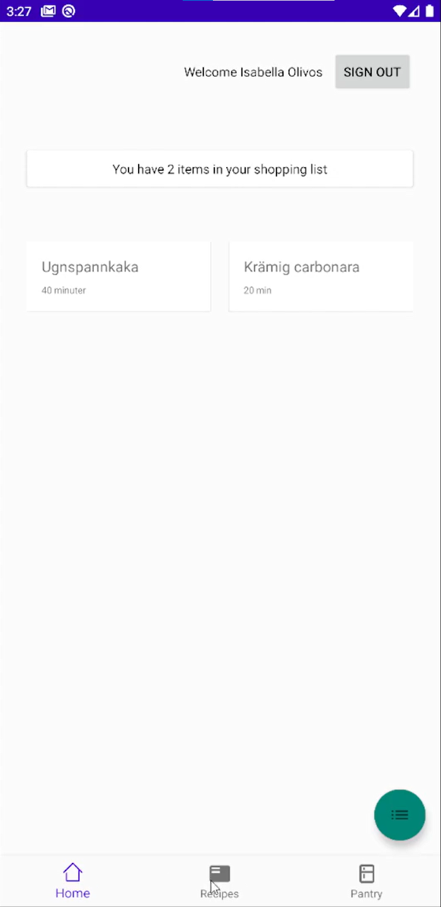
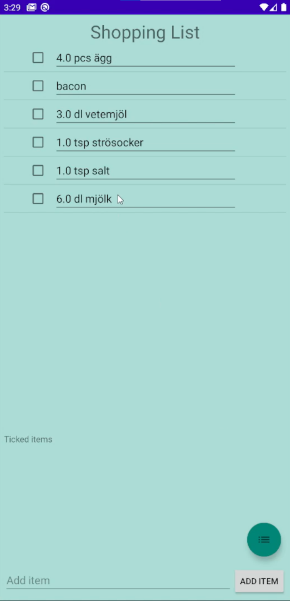
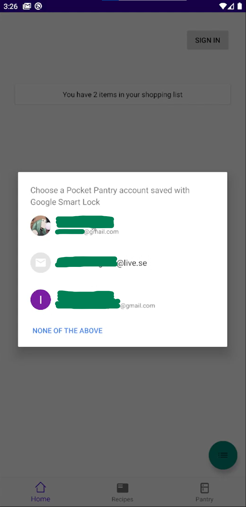
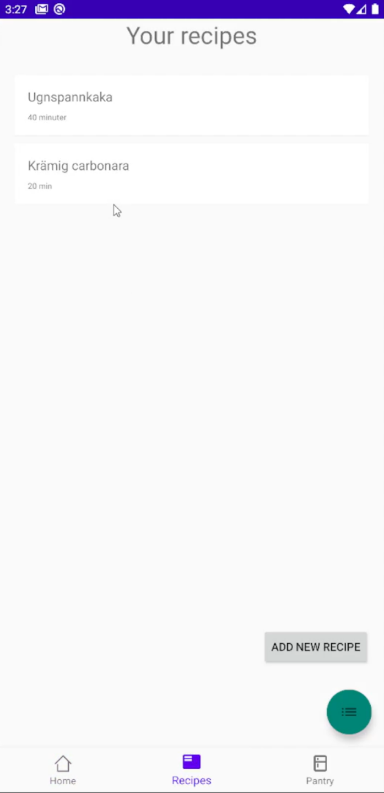
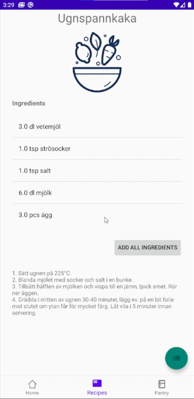
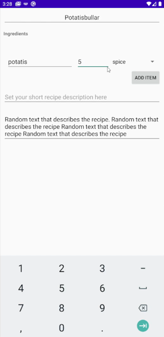

<h1> TDP028 Pocket Pantry</h1>

 Screenshots          |   __________________________
:-------------------------:|:-------------------------:
 |  
 | 
 | 

<h2>About</h2>

Pocket Pantry is made for you who want to be able to easily get a shopping list for your groceries from your favorite recipes. 

This application is created by Isabella Olivos for a school project for the course Entrepreneurial programming (TDP028).

<h2>Features</h2>

- Save recipes

- Automatically generated shopping lists

- User account

- Firestore database integrated

<h2> Upcoming Features</h2>

- Notifications for exporation dates on your groceries

- Your current pantry

- Scan barcodes

- Database for groceries

- Price comparision

- GPS integrated to find the closest store

